# Another Me - 智能体编排架构设计 v1.0

## 1. 概述 (Overview)

"Another Me" 是一个先进的智能体编排系统，通过智能任务编排、持续决策引擎和反馈分析，实现了真正的自主运行和自适应工作流。系统区别于传统的基于请求-响应模式，采用**智能编排 + 持续决策**的架构，能够基于Agent输出进行持续分析和决策，自主判断何时继续执行、生成新任务或进入等待状态。

### 核心特性：
- **智能任务编排：** 支持串行、并行、混合执行模式的复杂工作流
- **持续决策循环：** 基于Agent输出反馈的智能决策，支持多轮自适应执行
- **自主资源管理：** 并发控制、资源监控、性能优化
- **深度反馈分析：** LLM驱动的Agent输出分析和洞察生成
- **成本效益运行：** 智能等待模式和监控任务委托

## 2. 系统架构概览

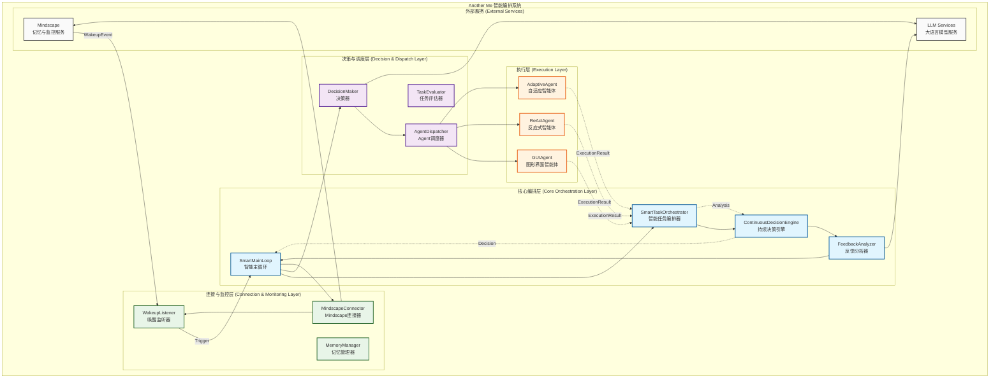

## 3. 核心组件详解

### 3.1. 智能主循环 (SmartMainLoop)

**位置:** `internal/core/mainloop.go`

智能主循环是整个系统的核心驱动器，负责协调所有组件的协作，实现真正的智能编排。

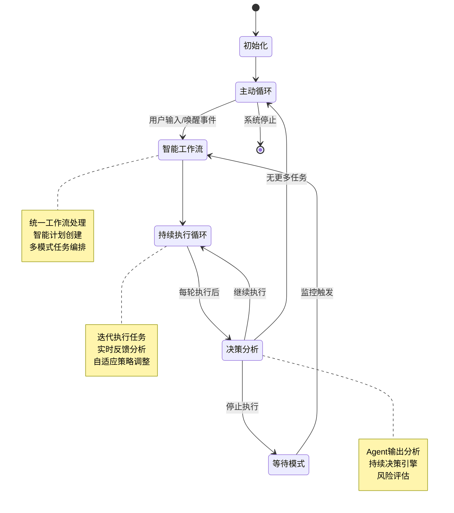

**核心职责:**
- **统一工作流编排:** 处理用户输入和唤醒事件，转换为智能工作流
- **持续执行管理:** 支持多轮迭代执行，基于反馈进行自适应调整
- **智能状态切换:** 在主动执行和等待监控之间智能切换
- **资源协调:** 协调所有组件的协作，确保系统稳定运行

### 3.2. 智能任务编排器 (SmartTaskOrchestrator)

**位置:** `internal/core/orchestrator.go`

智能任务编排器是系统的执行引擎，支持复杂的并行、串行、混合任务编排。

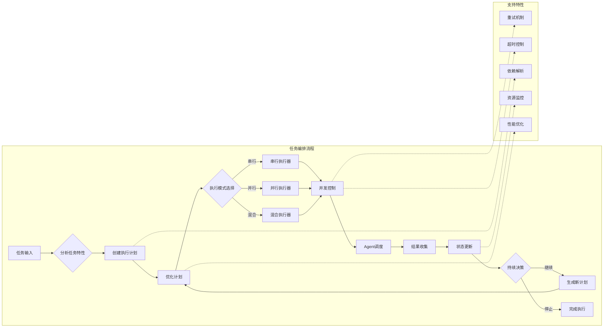

**核心特性:**
- **多模式执行:** 串行、并行、混合执行模式
- **智能计划创建:** 基于任务特性自动生成最优执行计划
- **动态优化:** 基于历史性能数据进行计划优化
- **并发控制:** 信号量机制防止资源过载
- **持续监控:** 实时监控执行状态和系统资源

### 3.3. 持续决策引擎 (ContinuousDecisionEngine)

**位置:** `internal/core/interfaces.go` (接口定义)

持续决策引擎是系统智能化的核心，基于Agent输出反馈进行深度分析和智能决策。

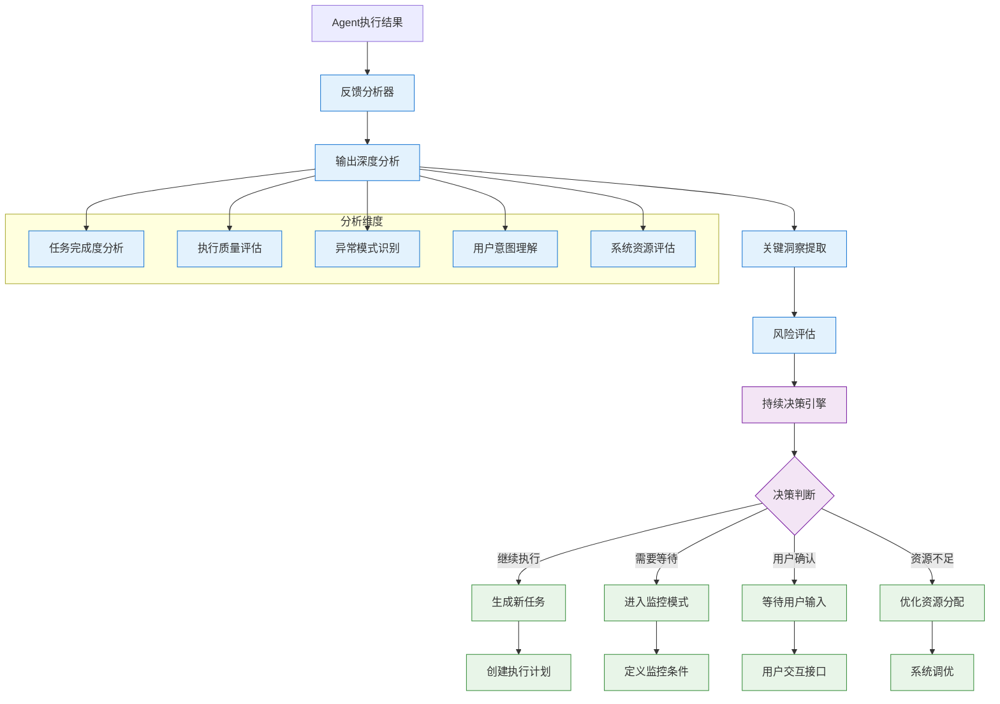

**智能决策特性:**
- **深度反馈分析:** LLM驱动的Agent输出分析
- **多维度评估:** 完成度、质量、风险、资源等综合评估
- **自适应策略:** 基于分析结果动态调整执行策略
- **智能循环控制:** 自主决定何时继续、等待或停止

### 3.4. 反馈分析器 (FeedbackAnalyzer)

专门负责深度分析Agent执行结果，提取关键洞察和模式识别。

**核心功能:**
- **执行模式识别:** 成功/失败模式的自动识别
- **质量评估:** 多维度的执行质量分析
- **风险预测:** 基于历史数据的风险预测
- **洞察生成:** 可执行的改进建议和下一步行动

## 4. 智能工作流程

### 4.1. 完整执行流程

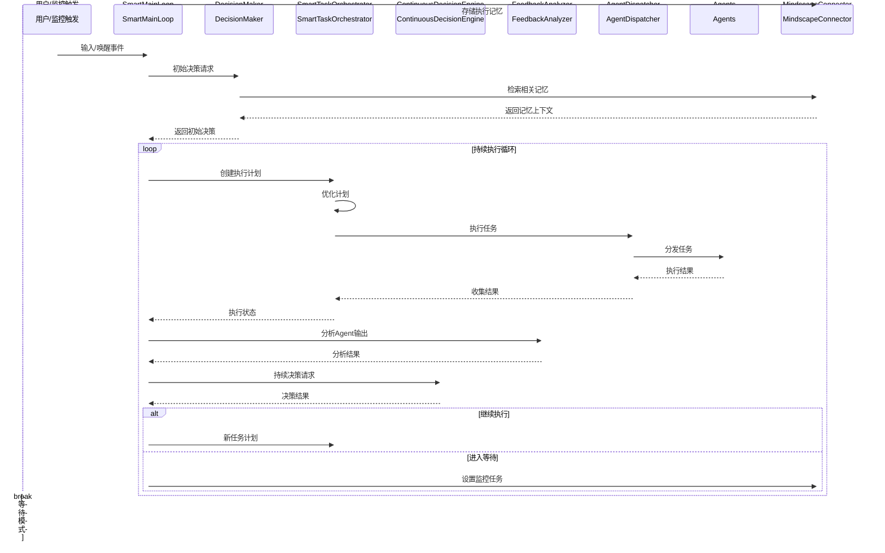

### 4.2. 决策流程详解

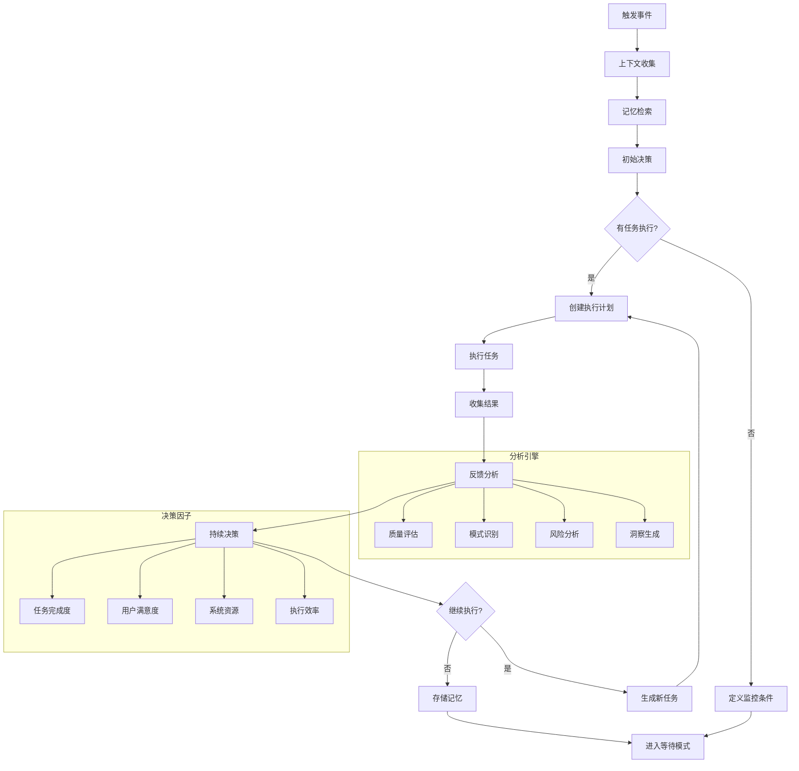

## 5. 数据结构与类型系统

### 5.1. 核心数据流

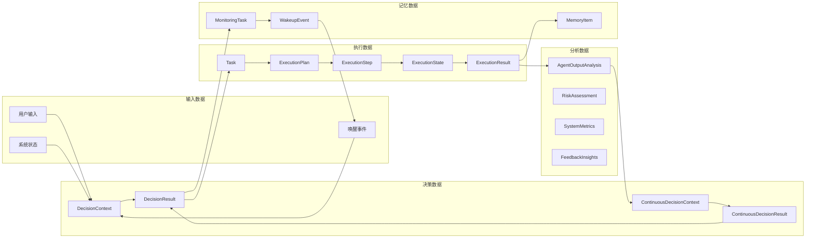

### 5.2. 执行模式架构

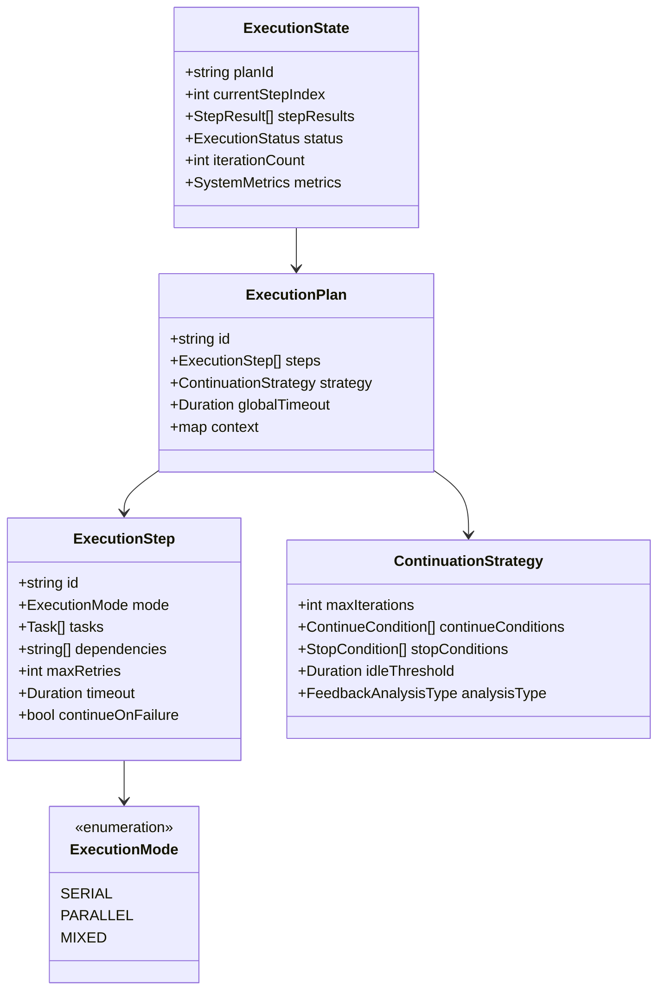

## 6. 智能特性详解

### 6.1. 并发控制与资源管理

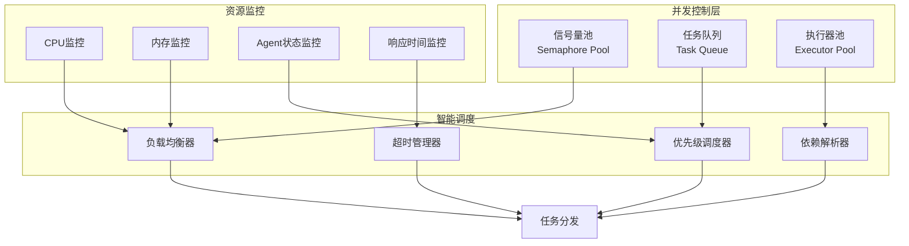

### 6.2. 智能决策算法

**持续决策评估矩阵:**

| 维度 | 评估因子 | 权重 | 决策影响 |
|------|----------|------|----------|
| 任务完成度 | 成功率、质量分数 | 0.3 | 继续/停止 |
| 用户意图 | 满意度、需求匹配 | 0.25 | 任务调整 |
| 系统资源 | CPU、内存、Agent可用性 | 0.2 | 并发控制 |
| 执行效率 | 响应时间、吞吐量 | 0.15 | 优化策略 |
| 风险评估 | 错误率、异常模式 | 0.1 | 安全控制 |

## 7. 与 Mindscape 的高级集成

### 7.1. 智能记忆管理

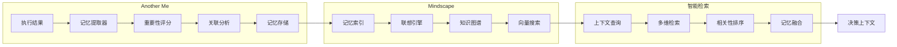

### 7.2. 监控任务智能化

**监控条件类型:**
- **环境感知:** 应用启动、屏幕内容变化、用户行为模式
- **时间触发:** 定时任务、周期性检查、时间窗口监控
- **状态监控:** 系统状态变化、资源阈值、错误模式
- **用户意图:** 隐式需求识别、行为预测、偏好学习

## 8. 性能优化与可扩展性

### 8.1. 系统性能指标

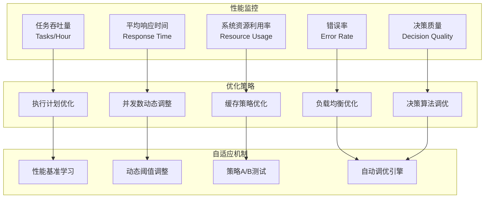

### 8.2. 可扩展性设计

**组件可扩展性:**
- **Agent扩展:** 插件化Agent接口，支持动态加载
- **决策引擎扩展:** 可插拔决策策略，支持自定义算法
- **分析器扩展:** 模块化分析器，支持多种分析维度
- **监控扩展:** 灵活的监控条件定义，支持自定义监控器

## 9. 错误处理与系统韧性

### 9.1. 多层错误处理

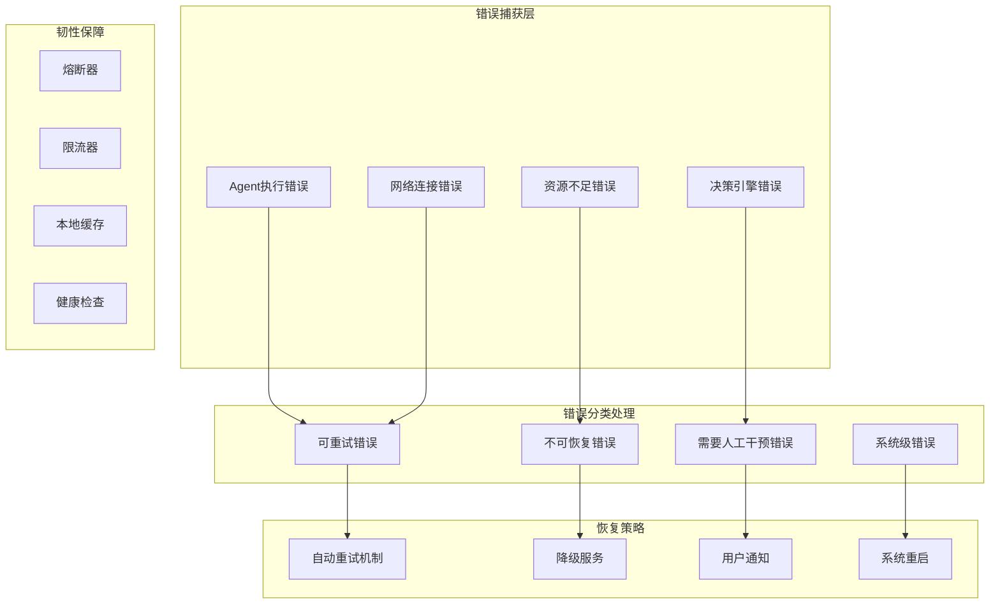

### 9.2. 系统韧性机制

**故障隔离:** 组件间故障隔离，防止级联失败
**优雅降级:** 核心功能保障，非核心功能降级
**自动恢复:** 智能故障检测和自动恢复机制
**状态恢复:** 持久化关键状态，支持断点续传

## 10. 未来演进方向

### 10.1. 技术演进路线图

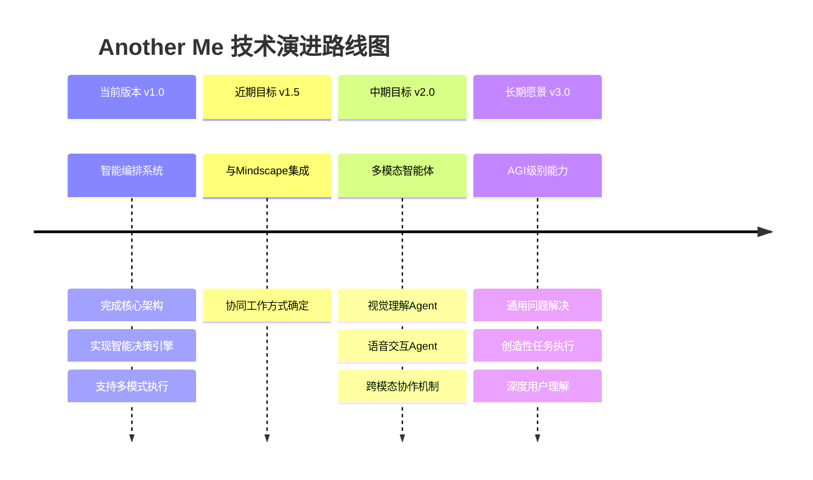

### 10.2. 架构演进

**智能化程度提升:**
- 从规则驱动到深度学习驱动
- 从单一决策到多层次认知
- 从被动响应到主动预测

**生态系统扩展:**
- Agent市场和插件生态
- 第三方服务深度集成
- 开放API和开发者平台

**用户体验优化:**
- 更自然的交互方式
- 更精准的意图理解
- 更个性化的服务提供

---

## 11. 总结

Another Me v1.0 智能编排系统代表了AI Agent系统架构的重大进展。通过智能任务编排、持续决策引擎、深度反馈分析等创新机制，系统实现了真正的自主运行和自适应能力。

**核心优势:**
1. **智能化:** LLM驱动的深度分析和决策
2. **自适应:** 基于反馈的持续优化和学习
3. **高效性:** 智能并发控制和资源管理
4. **可扩展:** 模块化设计和插件化架构
5. **韧性强:** 多层错误处理和故障恢复

这个架构为构建下一代智能助手和自主Agent系统提供了坚实的技术基础，能够支撑从个人助手到企业级自动化的各种应用场景。
